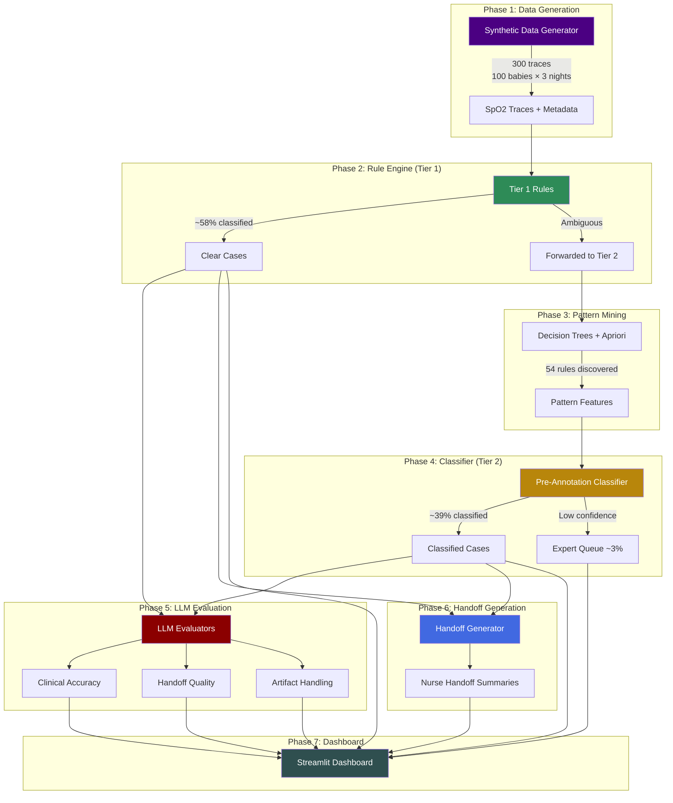

# Architecture

## Pipeline Overview

The SpO2 AI Eval Pipeline is a 7-phase system that processes neonatal pulse oximetry data through progressive triage layers, evaluates classification quality using LLM-as-judge, and generates nurse-facing clinical handoffs.

## Phase Descriptions

### Phase 1: Synthetic Data Generator (`src/data_gen/synthetic.py`)
Generates realistic neonatal SpO2 traces with:
- **Gestational age modeling**: Preterm (24-36w) vs. term (37-44w) baseline SpO2 differences
- **Desaturation events**: Varying severity, duration, and recovery patterns
- **Artifact injection**: Motion artifact, probe displacement, signal dropout
- **Ground truth labels**: 5 tiers (emergency, urgent, monitor, routine, artifact)

Output: 300 traces (100 synthetic babies × 3 nights each) with associated metadata.

### Phase 2: Rule Engine — Tier 1 (`src/rules/tier1_engine.py`)
Threshold-based classification for clear-cut cases:
- **Emergency**: SpO2 <80% sustained ≥30 seconds
- **Urgent**: SpO2 below GA-adjusted threshold (e.g., <88% for extremely preterm, <90% for term)
- **Artifact**: High signal variance + low perfusion index patterns
- **Routine**: Stable SpO2 within normal range for gestational age
- **Safety check**: Raw signal analysis prevents artifact classification from masking genuine desaturation events

Coverage: ~58% of traces auto-classified with 96% accuracy.

### Phase 3: Pattern Mining (`src/patterns/`)
Discovers classification rules from Tier 1 outputs:
- **Feature engineering** (`feature_eng.py`): Statistical features from SpO2 traces (mean, min, std, percentiles, SatSeconds burden, event counts)
- **Rule mining** (`miner.py`): Decision tree extraction (4 rules) + Apriori association rules (50 rules)

These patterns become features for the Tier 2 classifier.

### Phase 4: Pre-Annotation Classifier — Tier 2 (`src/classifier/`)
Machine learning classifier for ambiguous cases:
- **`tier2.py`**: Trains on Tier 1 outputs + mined features. Classifies cases the rule engine couldn't confidently label.
- **`expert_sim.py`**: Simulates expert review for the remaining ~3% lowest-confidence cases (expert queue)
- **Domain shift warning**: Tier 2 is trained on "easy" cases (Tier 1 outputs) but tested on harder ones — accuracy reflects this distribution mismatch.

### Phase 5: LLM Evaluators (`src/evals/`)
Three LLM-as-judge evaluators assess pipeline output quality:
- **Clinical Accuracy** (`clinical_accuracy.py`): Does the triage tier match the clinical picture?
- **Handoff Quality** (`handoff_quality.py`): Is the nurse handoff actionable, complete, and appropriate for the urgency level?
- **Artifact Handling** (`artifact_handling.py`): Are artifact-affected traces correctly identified and handled?

Each evaluator runs in mock mode ($0) or live mode (Claude API, ~$0.02/trace).

### Phase 6: Handoff Generator (`src/handoff/generator.py`)
Generates structured nurse handoff summaries:
- 5 templates: emergency, urgent, monitor, routine, artifact
- Includes: SpO2 statistics, desaturation event details, SatSeconds burden, recommended actions, clinical correlation questions
- Live mode uses Claude for natural language generation; mock mode uses templates

### Phase 7: Streamlit Dashboard (`app/dashboard.py`)
7-view interactive dashboard:
1. **Pipeline Overview**: Phase status, tier distribution, accuracy metrics
2. **Tier 1 Analysis**: Rule engine classification breakdown
3. **Tier 2 Analysis**: Classifier performance with domain shift warning
4. **LLM Eval Results**: Evaluator pass rates by type
5. **Handoff Quality**: Sample handoffs with quality scores
6. **Per-Label Metrics**: Sensitivity, PPV, F1 per triage tier
7. **HL7 Interoperability**: Sample HL7v2 messages and FHIR bundles

## Key Design Decisions

### Three-Tier Classification
Rather than a single classifier, the pipeline uses progressive refinement:
1. **Rules first**: Cheap, fast, interpretable, auditable for regulatory purposes
2. **ML second**: Handles the ambiguous middle where rules can't confidently classify
3. **Expert queue**: Admits uncertainty rather than forcing a classification

This mirrors real clinical workflows where clear cases are triaged quickly and complex ones escalate.

### LLM-as-Judge Evaluation
Traditional metrics (accuracy, F1) don't capture clinical nuance. LLM evaluators can assess:
- Whether action items in handoffs are clinically appropriate
- Whether urgency language matches the clinical severity
- Whether artifact handling preserves safety (doesn't mask real events)

Mock mode uses template-based scoring for development; live mode uses Claude for production-quality evaluation.

### Safety Check Architecture
The safety check (`tier1_engine.py`) is a hard constraint, not a soft signal:
- If the rule engine would classify a trace as "artifact" but raw signal analysis detects a genuine desaturation (SpO2 <threshold sustained), the classification is overridden to "urgent" or "emergency"
- This prevents the most dangerous failure mode: a real desaturation event being dismissed as artifact

### GA-Adjusted Thresholds
Neonatal SpO2 normal ranges vary significantly by gestational age:
- Extremely preterm (24-28w): Lower baseline SpO2, different threshold for "urgent"
- Term (37-44w): Standard adult-like thresholds apply
- Thresholds sourced from published neonatal references (Castillo 2008, Hay 2002)
